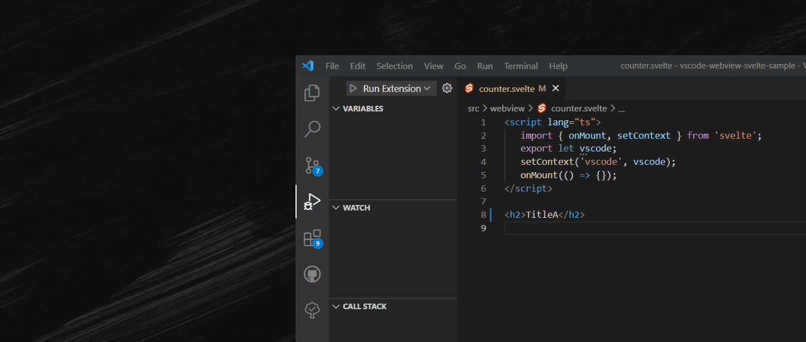

# vscode-webview-hotreload
VSCode extension for enabling hot reload when coding webview.



# How to use
1. Set environment variable `VSCODE_WEBVIEW_HOTRELOAD_IS_DEBUGGING` as `true` to extension's `launch.json` wanted to use hot reload.
```diff
      {
         "name": "Run Extension",
         "type": "extensionHost",
         "request": "launch",
         "args": [
            "--extensionDevelopmentPath=${workspaceFolder}"
         ],
         "outFiles": [
            "${workspaceFolder}/dist/**/*.js"
         ],
         "preLaunchTask": "${defaultBuildTask}",
+         "env": {
+            "VSCODE_WEBVIEW_HOTRELOAD_IS_DEBUGGING": "true"
+         }
      },
```
2. Set folder of webview code as `vscode-webview-hotreload.watchFolder`.
   (ex. `"vscode-webview-hotreload.watchFolder": "c:\\Users\\81701\\Desktop\\vscode-webview-svelte-sample\\dist"`)

3. Start debug session and active webview.
4. If you changed webview code, webview will reload.
